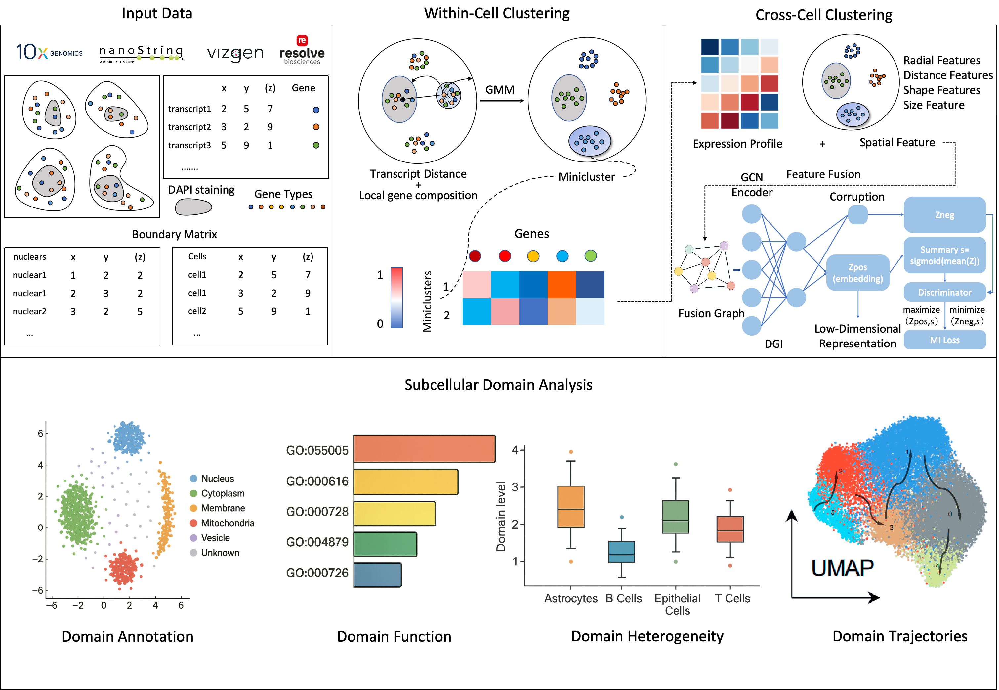

# CellScope

Unsupervised subcellular clustering and annotation for high-resolution Spatial Transcriptomics

CellScope is a computational pipeline for cell identification and subcellular annotation on high-resolution spatial transcriptomics data. It supports sequencing-based technologies (e.g., Stereo-seq, Seq-Scope) and imaging-based technologies (e.g., seqFISH+, Xenium). The repository provides a CLI and a configurable, modular pipeline with resume and lightweight checkpoints.



## System Requirements
**Operating System**: Linux (tested on Rocky Linux 9.4)

**Core Python Dependencies**:
```
scanpy
anndata
pandas
numpy
scikit-learn
scipy
shapely
pyarrow
hdbscan
matplotlib
seaborn
umap-learn
python-igraph
leidenalg
PyYAML
```
See `requirements.txt` for the full list.

## Install CellScope
### Recommended (Conda environment)
```bash
git clone https://github.com/zhoutianrui-tongji/CellScope.git
cd CellScope
conda create -n cellscope-env python=3.9
conda activate cellscope-env
pip install -r requirements.txt
pip install -e .
```

## Documentation
Configuration and usage are documented in this `README.md` and the `docs/` folder. The main configuration is `CellScope/config/params.yaml` (I/O, module parameters, annotation settings).

## Usage
```bash
cellscope --help
usage: cellscope [OPTIONS]

Options:
  --spatial PATH               Input transcripts CSV/Parquet
  --cell-boundaries PATH       Cell boundaries CSV/Parquet
  --nucleus-boundaries PATH    Nucleus boundaries CSV/Parquet
  --out-dir PATH               Output directory
  --config PATH                YAML config (default: CellScope/config/params.yaml)
  --internal-progress          Show internal progress
  --no-resume                  Disable resume
  --no-save-intermediate       Do not persist intermediate artifacts
  --version                    Print version
```
Example:
```bash
cellscope \
  --spatial test_data/test_transcripts_df.csv \
  --cell-boundaries test_data/test_cell_boundaries_df.csv \
  --nucleus-boundaries test_data/test_nucleus_boundaries_df.csv \
  --out-dir test_out
```

## Inputs

CellScope expects three primary tabular inputs (CSV or Parquet), with required columns as below.

1) Transcripts table (`--spatial`)
- Required columns: `cell_id`, `x_location`, `y_location`, `feature_name`, `overlaps_nucleus`
- Meaning:
	- `cell_id`: the cell identifier each transcript belongs to
	- `x_location`/`y_location`: transcript coordinates in image/pixel space
	- `feature_name`: gene or feature name of the transcript (e.g. `ACTB`)
	- `overlaps_nucleus`: whether the transcript lies within the nucleus (boolean `0/1` or `true/false`).
		- Note: The preprocessing step filters to cells that have both `overlaps_nucleus==0` and `==1`, so this column must be present for standard runs.
- Example (CSV):
	```csv
	cell_id,x_location,y_location,feature_name,overlaps_nucleus
	C001,102.3,55.8,ACTB,0
	C001,98.1,60.2,GAPDH,1
	C002,210.0,120.5,TUBB,0
	```

2) Cell boundaries (`--cell-boundaries`)
- Required columns: `cell_id`, `vertex_x`, `vertex_y`
- Meaning:
	- Each row is one polygon vertex of a cell boundary; vertices with the same `cell_id` are grouped to form the polygon.
	- Vertex ordering should trace the boundary (clockwise or counter‑clockwise) for each `cell_id`.
- Example (CSV):
	```csv
	cell_id,vertex_x,vertex_y
	C001,90.0,40.0
	C001,130.0,40.0
	C001,130.0,80.0
	C001,90.0,80.0
	C002,200.0,100.0
	C002,240.0,100.0
	C002,240.0,140.0
	C002,200.0,140.0
	```

3) Nucleus boundaries (`--nucleus-boundaries`)
- Schema identical to cell boundaries: `cell_id`, `vertex_x`, `vertex_y`
- Vertices with the same `cell_id` define the nucleus polygon of that cell.
- Example (CSV):
	```csv
	cell_id,vertex_x,vertex_y
	C001,100.0,50.0
	C001,120.0,50.0
	C001,120.0,70.0
	C001,100.0,70.0
	```

Notes:
- Column names are currently fixed as above; validation will error if any are missing.
- CSV/Parquet are auto‑detected; top‑5 sampling previews print unless `--no-show-sample`.
- Coordinates should be in the same reference frame for transcripts and boundaries.

## Outputs

- `adata1.h5ad`: per‑cell/metaspot table (after M4–M5).
- `adata2.h5ad`: meta‑domain table (after M6–M8).
- `final_data.csv|parquet`: transcript‑level results including clustering and annotation.


## Notes
- Performance: CSR-based BoW/TF-IDF/SVD in Module 2; neighbor graph via `sklearn.kneighbors_graph`; tuned KDTree queries.
- Robustness: Leiden auto fallback (`igraph` → `leidenalg`); neighbor construction falls back and ensures CSR output.
- Outputs: `module5_final_data.csv` (or `.parquet`) in `out_dir`, plus intermediate directory if enabled.

## Verify
```bash
cellscope --version
cellscope --help
```